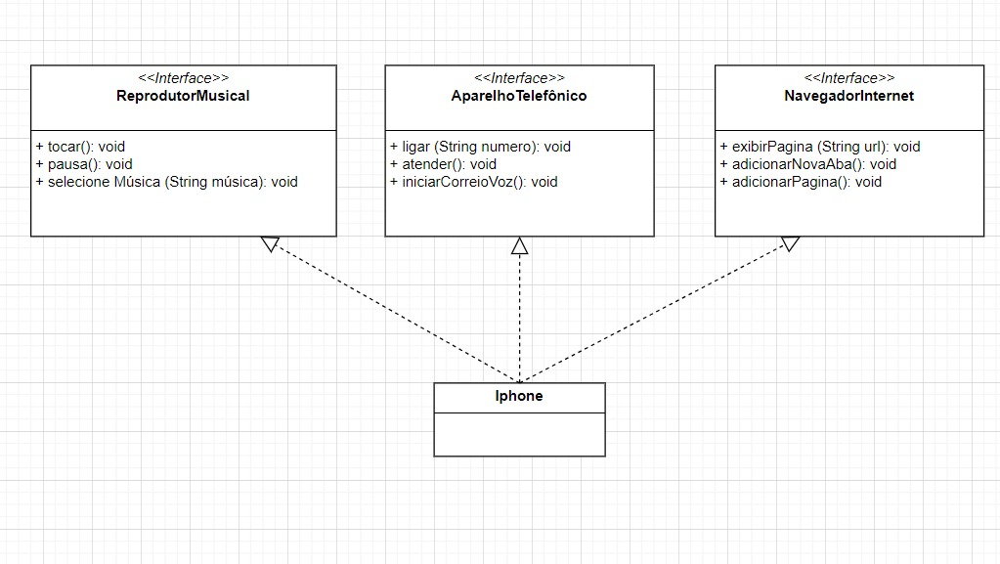

# Projeto iPhone - Desafio de POO

Este projeto é a resolução do desafio da DIO - Trilha Java Básico, ministrado por Gleyson Sampaio. O desafio consiste em modelar e diagramar a representação UML de um componente iPhone, abrangendo suas funcionalidades como Reprodutor Musical, Aparelho Telefônico e Navegador na Internet.

## Contexto

Com base no vídeo de lançamento do iPhone de 2007, foram modeladas e diagramadas as funcionalidades do dispositivo conforme as instruções. O objetivo era criar um diagrama UML que representasse as funcionalidades descritas e implementar as classes e interfaces correspondentes em Java.

## Funcionalidades a Modelar

### Reprodutor Musical
- `tocar()`: Inicia a reprodução da música.
- `pausar()`: Pausa a música.
- `selecionarMusica(String musica)`: Seleciona uma música específica.

### Aparelho Telefônico
- `ligar(String numero)`: Realiza uma ligação para o número especificado.
- `atender()`: Atende uma chamada.
- `iniciarCorreioVoz()`: Inicia o correio de voz.

### Navegador de Internet
- `exibirPagina(String url)`: Exibe a página da web especificada.
- `adicionarNovaAba()`: Adiciona uma nova aba no navegador.
- `atualizarPagina()`: Atualiza a página atual.

## Diagrama UML

O diagrama UML a seguir representa a modelagem das funcionalidades do iPhone:

[Ver o diagrama UML](https://drive.google.com/file/d/1UAEQ3liXHp-ROK_VnXFBGG8upQre51nw/view?usp=sharing)

